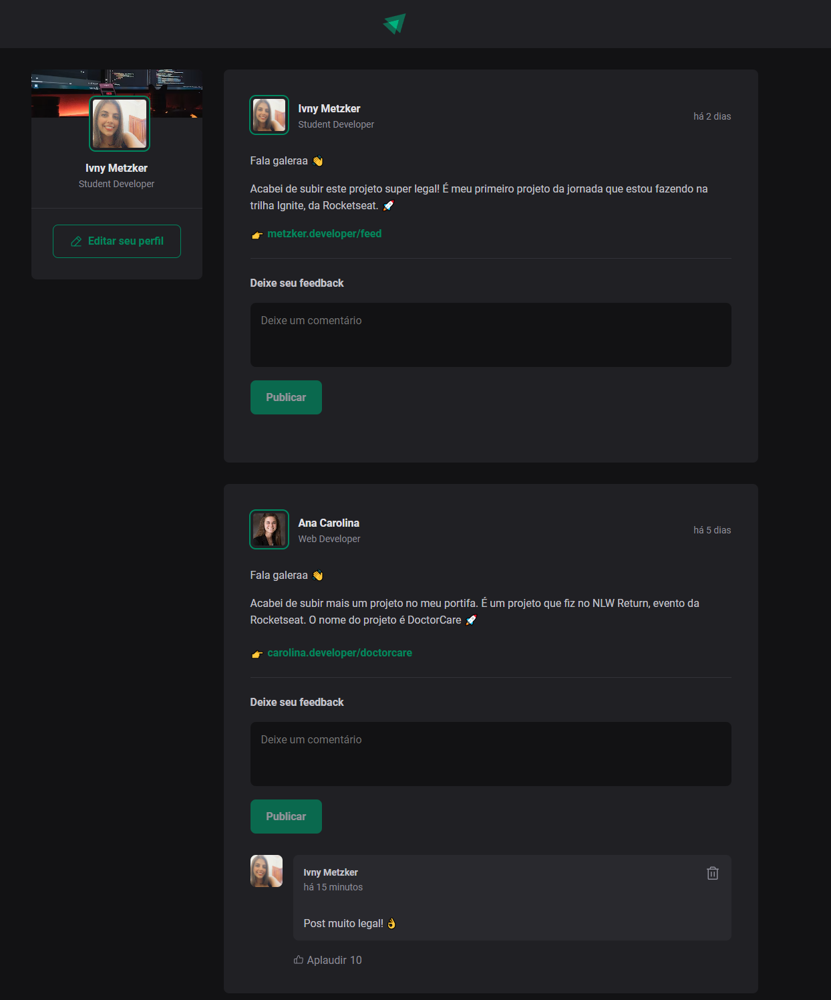

<table align="left">
    <tr>
        <td>
            <b>
              <a href="README.md"> 🇧🇷 Português </a>
            </b>
        </td>
        <td>
            <a href="readme-us.md"> 🇺🇸 English </a>
        </td>
    </tr>
</table>


<p align="right">
  <a href="#-tecnologias">Tecnologias</a>&nbsp;&nbsp;&nbsp;|&nbsp;&nbsp;&nbsp;
  <a href="#-projeto">Projeto</a>&nbsp;&nbsp;&nbsp;|&nbsp;&nbsp;&nbsp;
  <a href="#-layout">Layout</a>
</p>

<br> <br>

# Feed

 


<br>

## 🚀 Projeto

O projeto consiste na criação de um feed com posts estáticos simulando consumo em banco de dados, sendo estes posts mapeados em tela e em cada post pode-se ter a interação de adicionar novos comentários com validação de formulário para permitir ou não a publicação do comentário, permite remover os comentários e adicionar aplausos aos comentários existentes.

<br>

### ⚙ Funcionalidades
- Validação de formulário;
- Adicionar comentários;
- Remover comentários
- Aplaudir comentários;
- Horário dinâmico dos comentários.

### 🛸 Requisitos
- **React:** v18.2.0
- **Node:** v18.17.1
- Yarn
- Vite

### 🛠 Execute a Aplicação
Para executar a aplicação na sua máquina local, siga estes passos:
<br>
1. Clone o repositório usando o comando:

```bash
git clone https://github.com/iMetzker/financial-control.git
```
2. Abra o projeto em seu ambiente de desenvolvimento.

3. Certifique-se de de que o yarn esteja instalado. Caso contrário abra o terminal do seu ambiente de desenvolvimento e execute o comando:

```bash
npm install -g yarn
```
4. Inicie o servidor para vizualizar o projeto usando o comando:

```bash
yarn run start
```
<br>

## 🛸 Tecnologias

Esse projeto será desenvolvido com as seguintes tecnologias:

- React;
- Styled Components;
- Git.

## 💻 Layout



<br>

<p align="center">🔎 Visite o site em execução <a href="https://feed-imetzker.netlify.app/">aqui</a>
</p>


